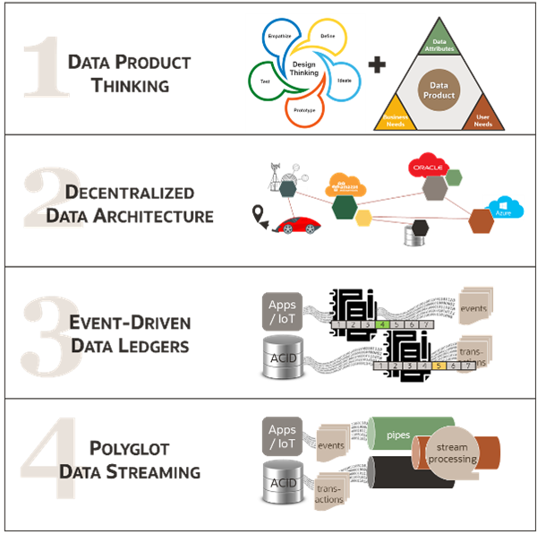
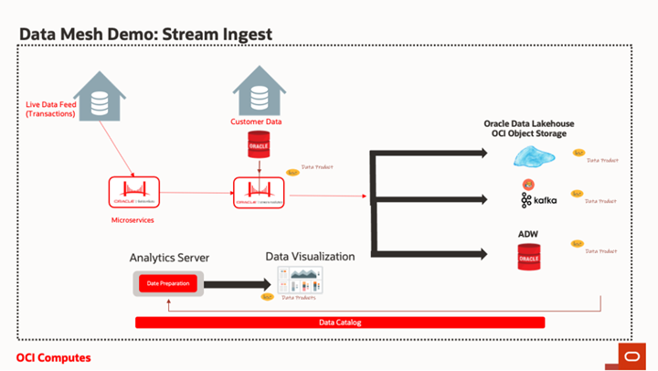

# Introduction

## About this Workshop

This workshop is to educate users on a Streaming Ingest Data Mesh scenario for IoT. We will examine IoT data that will be used in conjunction with live streaming data to determine if a customer is likely to be a spender, which will trigger events in a Kafka topic to encourage spending. OML models will be created to filter the data in a GGSA environment. Users will learn how to create a pipeline, joining live data and static data from the database to an OML model, Kafka, and OAS. OAS will be used to support analysis on decisions.

A New Concept for Data – Oracle’s Approach:
1.	Emphasizes cultural change, as a mindset shift towards thinking of data ‘as a product’ – which in turn can prompt organizational and process changes to manage data as a tangible, real capital asset of the business.
2.	Calls for alignment across operational and analytic data domains. A Data Mesh aims to link data producers directly to data consumers and remove the IT middleman from the processes that ingest, prepare and transform data resources.
3.	Technology platform built for ‘data in motion’ is a key indicator of success – a two-sided platform that links enterprise data producers and consumers. Data Mesh core is a distributed architecture for on-prem and multi-cloud data.

A trusted Data Mesh is a data architecture approach focused on business outcomes, faster innovation cycles and trusted data-in-motion for both operational apps & analytics. A Data Mesh is implemented with the following key attributes: data product thinking, a decentralized data architecture, event-driven data ledgers, and polyglot streaming.

### Data Mesh Four Key Attributes

   

**1.	Data Product Thinking**
A mandatory attribute of Data Mesh concept is a commitment to treat data as a product. Data products may be a part of any kind of data architecture, but thinking of data as a product is a crucial part of all Data Mesh architecture since it puts the data consumers at the heart of the design.

**2.	Decentralized Data Architecture**
Today, the decentralized architecture is in fashion as a software design for applications and as a data architecture for the enterprise. Data is increasingly distributed across the networks: at the edge, multi-cloud, on-premises, cloud@customer, etc. Modern designs must account for this reality - treat it as a feature, not a bug.

**3.	Event-Driven Data Ledgers**
Ledgers are the fundamental component of making a distributed data architecture function. Just as with an accounting ledger, a data ledger records the Tx events as they happen. A Data Mesh is not just one single kind of ledger, it can make use of different types of event-driven data ledgers, depending on the use cases and requirements.

**4.	Polyglot Data Streaming**
A mandatory attribute of Data Mesh concept is a commitment to treat data as a product. Data products themselves may be a part of other data architectures, but data products are a crucial part of the inception of all Data Mesh designs.

### Streaming Ingest Use Case Summary & Architecture – IoT Data

In this lab, you will explore an IoT use case using streaming ingest to process real-time IoT data streams of customers to promote events to encourage more spending. You will identify if a customer is likely to be a spender.

   

Estimated Time: 115 minutes

### Objectives

In this workshop, you will complete the following labs:

- Prepare Data for Pipeline
- Review Microservices
- Create OML model
- Create pipeline
- Data feed and validation
- Analyze Data Products in OAS

### Prerequisites

This lab assumes you have:

- Familiarity with Database is desirable, but not required
- Some understanding of cloud and database terms is helpful
- Familiarity with Oracle Cloud Infrastructure (OCI) is helpful
- Familiarity with GoldenGate Data Replication

## Acknowledgements

- **Author**- Nicholas Cusato, Santa Monica Specialists Hub, July 14, 2022
- **Contributers**- Hadi Javaherian, Hannah Nguyen, Gia Villanueva, Akash Dahramshi
- **Last Updated By/Date** - Nicholas Cusato, Santa Monica Specialists Hub, July 14, 2022
