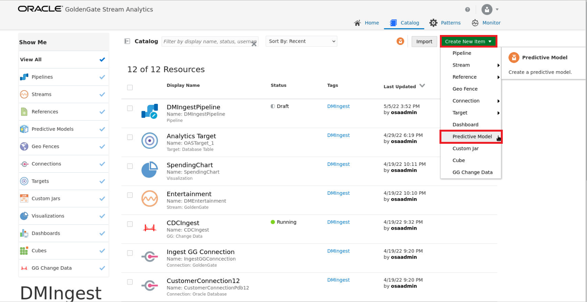
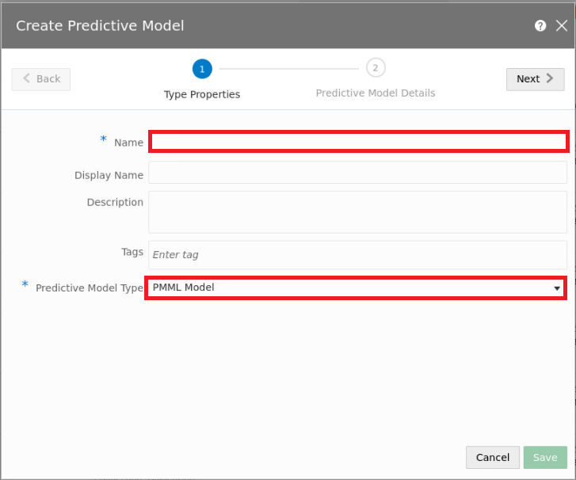
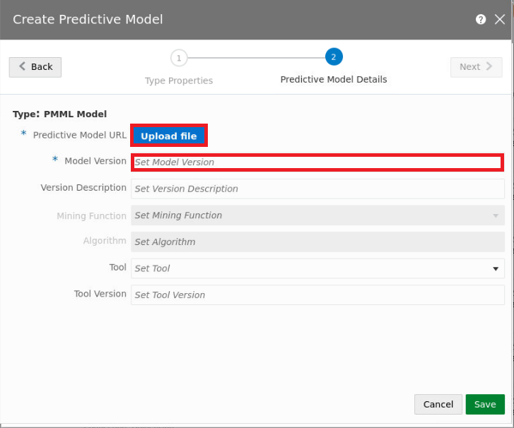

# Create OML model

## Introduction

In this lab, we will import a Machine Learning model that was previously trained using Python and converted into an Open Neural Network Exchange (ONNX) format.  
Estimated Time: 15 minutes

### Objectives

In this lab, you will complete the following tasks:

- Create Predictive model

### Prerequisites

This lab assumes you have:
- An Oracle Always Free/Free Tier, Paid or LiveLabs Cloud Account

## Task 1: Create Predictive Model

1. With the GGSA Catalog open, select **Create New Item** and from the drop down menu, select **Predictive Model**. 

     

2. In the new window that opens, add a name to the model and select Predictive Model Type **ONNX**. Select **Next** to proceed to updating the rest of the details.

     

3. Upload the Predictive Model URL and select a model version. 

     

You may now **proceed to the next lab.**

## Acknowledgements

- **Author**- Nicholas Cusato, Santa Monica Specialists Hub, July 14, 2022
- **Contributers**- Hadi Javaherian, Hannah Nguyen, Gia Villanueva, Akash Dahramshi
- **Last Updated By/Date** - Nicholas Cusato, Santa Monica Specialists Hub, July 14, 2022