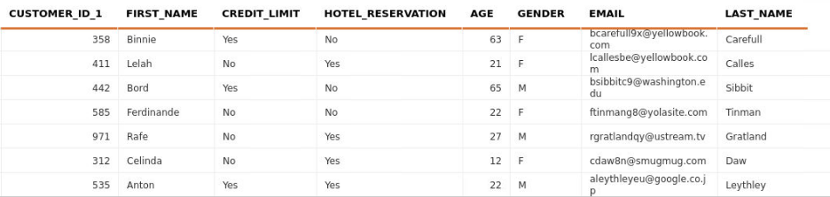
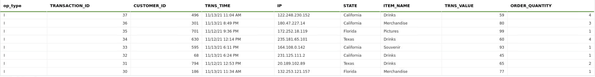
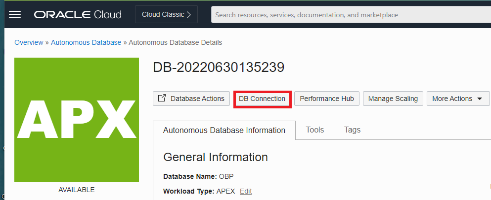
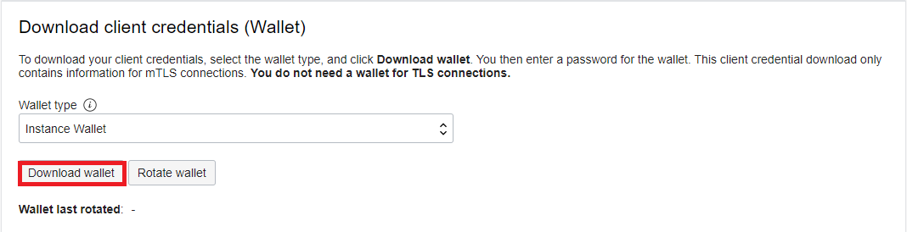
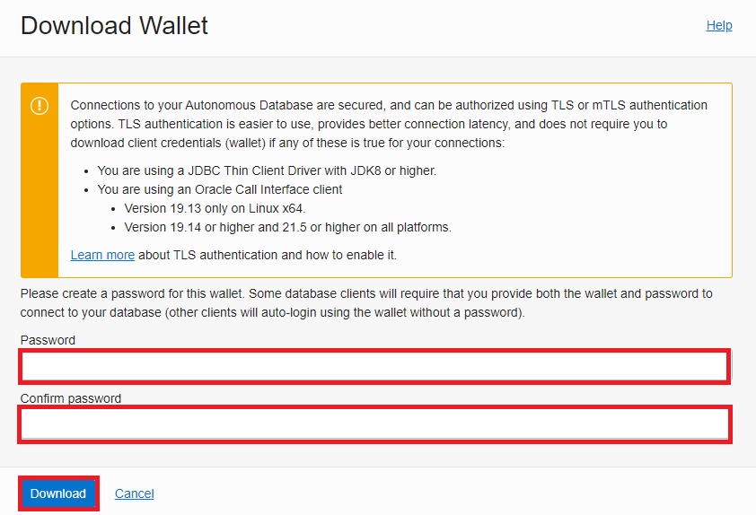
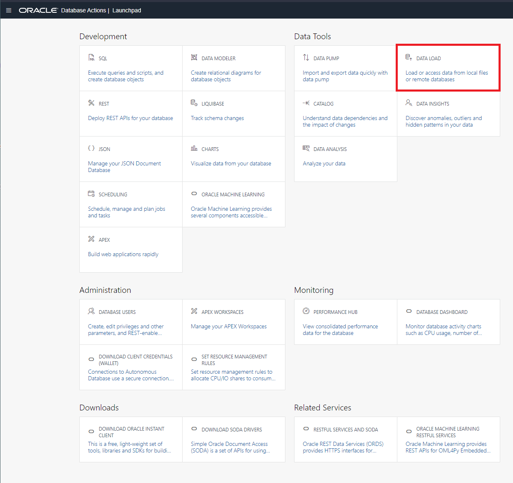
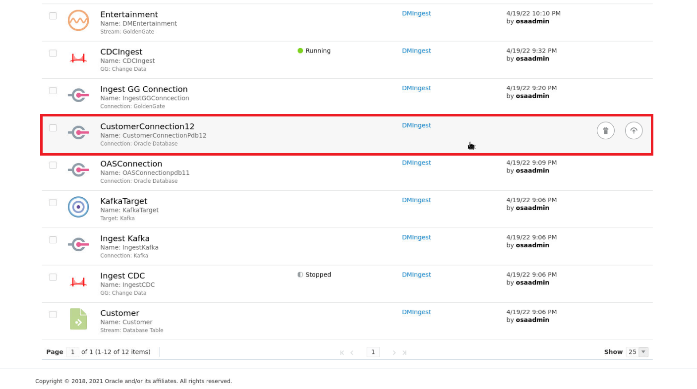
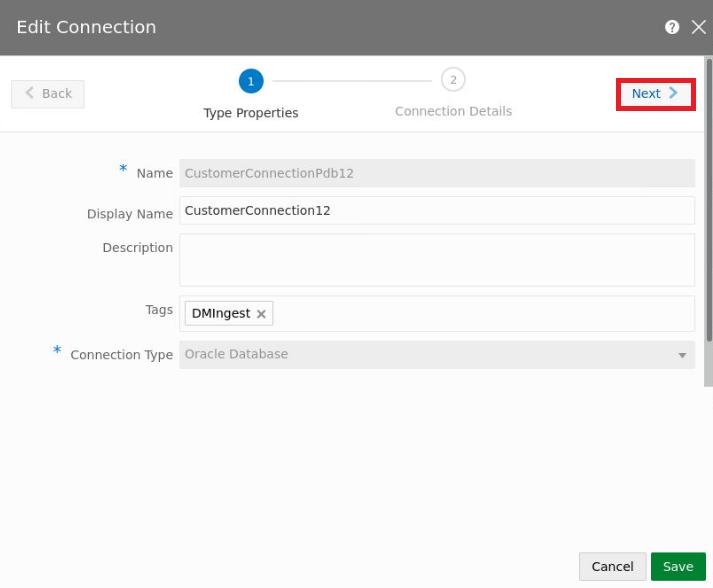
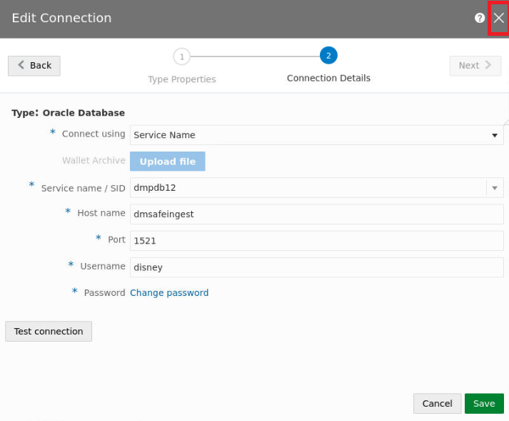

# Data Preparation

## Introduction

Establishing a connection to a database is important process of streaming ingest. The data collected by the customers is stored in the Oracle Autonomous Database (ADB). This data is ingested with event data to allow for events to be invoked based on a combination of factors that will be discussed later. This lab explores the data that be used in preparation of this lab.

Estimated Time: 15 minutes

### Objectives

In this lab, you will complete the following tasks:

- Analyze Customer data
- Analyze Event data
- Explore Upload Process
- Confirm Upload

### Prerequisites

This lab assumes you have:
- An Oracle Always Free/Free Tier, Paid or LiveLabs Cloud Account

## Task 1: Analyze Customer data

1. For the event, customers are required to register certain data. This is populated in a database for access during the streaming ingest. This information includes a customer ID number, first name, credit limit, hotel reservation, age, gender, email address and last name. The key column that links the event data is the **Customer ID**.

    

## Task 2: Analyze Event data

1. The event data is the streaming data that is produced during the festival. This includes op type, which is a consistent value based on the operation, transaction ID, customer ID, TRNS Time, which logs based on time of the transaction, IP address, State, Item name for purchase, TRNS Value, which is the total cost of transaction, and lastly, order quantity. Notice the key column **Customer ID** is again featured, as it is the key column for joining the datasets. 

    

## Task 3: Explore Upload Process

1. Customer data is stored in a database that is connected to the GGSA service. In order to connect the database table, SID, service name, or a wallet is required to establish this connection. For example, in OCI, after provisioning an ADB, selecting **DB Connection** will bring up the wallet options. This process is only for an example and is not required for completion of the lab, as we will be using another database connection.

    

2. Selecting **Download wallet** will require creating a password, which after confirmation, will allow you to download the zip file. 

    

    

3. Uploading data to Oracle ADB is easy. Selecting Database Actions will open a launch pad, where data can be uploaded using **Data Load**.

    

## Task 4: Confirm Upload

1. Now that we have discussed how to upload data to ADB and download wallet credentials, lets observe the connection in the GGSA portal. Select GGSA **customer connection** to edit the connection.

    

2. The first page displays the name, tags, and connection type. Select **Next** to view the connection details.

    

3. Notice on the connections page, the connect using **Service Name** is selected. Other options include SID or wallet (as discussed in previous task). Select **X** in the top right corner after observing the following:
   - The service name is **dmpdb12**. 
   - Host name is **dmsafeingest**.
   - Port number is **1521**.
   - Username is **disney**
   - Password is predefined with an option to change.

    

## Acknowledgements

- **Author**- Nicholas Cusato, Santa Monica Specialists Hub, July 14, 2022
- **Contributers**- Hadi Javaherian, Hannah Nguyen, Gia Villanueva, Akash Dahramshi
- **Last Updated By/Date** - Nicholas Cusato, Santa Monica Specialists Hub, July 14, 2022